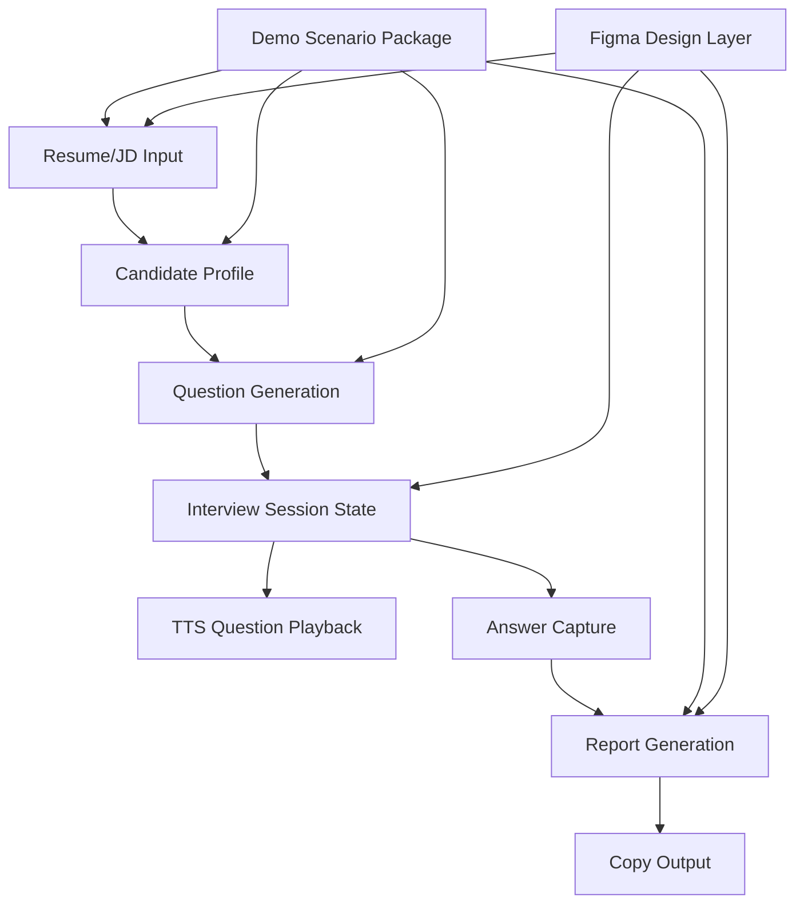

# Module Map And Tier Table

## Dependency View

## Tier Table

| Module | Tier | On Core Loop | Crosses Boundary | Owner | Rework Risk | Reason |
| --- | --- | --- | --- | --- | --- | --- |
| App Shell & State Machine | L1 | Yes | Yes | Dev | High | 串起全部流程，后续设计/接口都依赖状态定义 |
| Demo Scenario Package | L1 | Yes | Yes | Dev first | High | Demo 稳定性和产品样例都依赖它 |
| Profile Parse | L1 | Yes | Yes | Dev | High | 连接输入和问题生成，结构漂移会影响后续 |
| Question Generation | L1 | Yes | Yes | Dev | High | 核心价值点，依赖画像和风格 |
| Interview Session | L1 | Yes | Yes | Dev | High | 问题、答案、语音、报告的绑定中心 |
| Report Generation | L1 | Yes | Yes | Dev | High | 最终用户价值和复制内容都来自这里 |
| Voice Layer | L2 | Yes | Yes | Dev | Medium | 影响体验，但可降级为文本 |
| Design Integration Layer | L2 | No | Yes | Dev + Design | Medium | 设计稿后置，需避免重写业务 |
| Copy & Export | L2 | Yes | No | Dev | Medium | 影响收口体验，逻辑简单 |
| Local Server & Env | L2 | No | Yes | Dev | Medium | TTS/LLM 代理和密钥安全相关 |
| Analytics/History/Login | L3 | No | Yes | Deferred | Low | 本轮不做 |

## Highest Rework Risks

| Risk | Why | Control |
| --- | --- | --- |
| 画像/题目/报告字段不稳定 | 三个 L1 模块互相依赖 | 先冻结 API contract 和 schema |
| 设计稿晚到导致页面重做 | 视觉和状态混在一起会返工 | 先做业务组件边界和 token |
| TTS/STT 浏览器差异 | Chrome/Edge/移动端能力不同 | 做多层降级，不把语音当唯一入口 |
| 演示样例不稳定 | Hackathon 展示不能依赖实时模型完全稳定 | 固定演示兜底样例包 |
