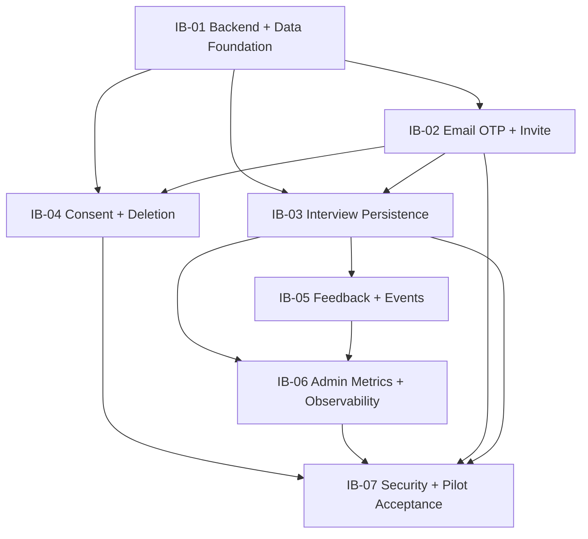

# PassBuddy 受控内测模块图与执行计划

## 1. Dependency View



## 2. Tier Table

| Module | Tier | Core Loop | Crosses Boundary | Rework Risk | Reason |
| --- | --- | --- | --- | --- | --- |
| IB-01 数据底座 | L1 | Yes | Yes | High | 决定所有持久化、权限和迁移边界 |
| IB-02 身份与邀请码 | L1 | Yes | Yes | High | 成为全流程新入口并跨 Auth/DB/UI |
| IB-03 主闭环持久化 | L1 | Yes | Yes | High | 把既有内存状态迁移为 DB source |
| IB-04 同意与删除 | L1 | Yes | Yes | High | 未同意会阻断入口，删除跨多表 |
| IB-05 反馈与事件 | L2 | No | Yes | Medium | 不阻断主闭环，但决定数据质量 |
| IB-06 看板与监控 | L2 | No | Yes | Medium | 跨 UI/DB/日志/第三方监控 |
| IB-07 安全与灰度 | L1 | Yes | Yes | High | 是真实用户开放前的系统级门禁 |

## 3. Work Estimates

| Task | Dev | Integration/QA | Total |
| --- | ---: | ---: | ---: |
| IB-01 | 0.5–1 | 0.5 | 1–1.5 |
| IB-02 | 2–2.5 | 1 | 3–3.5 |
| IB-03 | 2.5–3 | 1 | 3.5–4 |
| IB-04 | 0.5–1 | 0.5 | 1–1.5 |
| IB-05 | 0.5–1 | 0.5 | 1–1.5 |
| IB-06 | 2–2.5 | 1 | 3–3.5 |
| IB-07 | 1 | 1–2 | 2–3 |
| **纯实现** |  |  | **14–19** |

灰度问题修复和邮件送达校准另预留 4 人日，整体按 18–23 人日排期。

## 4. Execution Waves

### Wave 0：Document Gate

- Required: 01–06 docs approved.
- Evidence: 文档交叉审查通过；无未决架构项。
- Stop: 未确定腾讯云应用/数据库地域、未取得 SES 域名与模板审核或国内邮箱样本，不开始 IB-02 的真实 E2E。

### Wave 1：IB-01 → IB-02

- IB-01 完成数据库、clients、RLS 和迁移测试。
- IB-02 完成 OTP、Session、邀请码和 admin bootstrap。
- Gate: AUTH-001 至 AUTH-008、DATA-001 至 DATA-006 的相关部分有证据。

### Wave 2：IB-03 与 IB-04

- 先 IB-03 单用户 mirror，再切已登录用户 DB source。
- IB-04 可在 IB-01 后并行，但开始会话门禁需与 IB-03 集成。
- Gate: 一次完整会话可跨刷新恢复；删除演练可执行。

### Wave 3：IB-05 → IB-06

- 反馈和事件 schema 先稳定。
- 看板只消费 Contract 事件与业务表，不发明第二套指标。
- Gate: 抽样 SQL 与看板数字一致；告警故障注入通过。

### Wave 4：IB-07

- 系统级安全、兼容、回滚和 10–20 人灰度。
- Gate: `08_pilot_release_and_acceptance.md` 的 Go/No-Go。

## 5. Two-Person Split

| Owner A | Owner B | Shared Gate |
| --- | --- | --- |
| IB-01、IB-02 | 先准备 IB-04 UI/法务占位与测试设计 | Auth/Data gate |
| IB-03 | IB-04、IB-05 | Persistence/Consent gate |
| 修复主闭环 | IB-06 | Metrics/Alert gate |
| IB-07 security | IB-07 pilot/ops | Release decision |

不能并行修改同一个 source of truth 边界；`InterviewCoachApp` 的持久化接线由 IB-03 单一 owner 负责。

## 6. Planned File Boundaries

| Area | Suggested path |
| --- | --- |
| Database | `lib/db/pool.ts`, `context.ts`, `admin.ts`, repositories |
| Auth domain | `lib/auth/*`, `app/api/auth/[...all]/*`, wrapper APIs, auth UI |
| Email provider | `lib/email/*`（腾讯云 SES adapter） |
| Database migrations | `db/migrations/*` |
| Persistence | `lib/persistence/*`, `app/api/interview-sessions/*` |
| Consent/privacy | `lib/privacy/*`, `app/api/consent/*`, `app/api/privacy/*` |
| Events/feedback | `lib/analytics/*`, feedback/events Route Handlers |
| Admin | `app/admin/*`, `app/api/admin/*`, `lib/admin/*` |
| Monitoring | `instrumentation.ts`, Sentry config files, error boundaries |
| Tests | `tests/internal-beta/*`, updated smoke scripts |

文件名可因框架惯例调整，但 bounded context 不得合并成一个通用 `utils.ts`。

## 7. Shared Verification Commands

每个 task 至少运行：

```text
npm run typecheck
npm run build
npm run security:check
npm run smoke:contract -- <base-url>
```

本轮还需新增并稳定：

```text
npm run test:internal-beta
npm run smoke:auth -- <base-url>
npm run smoke:persistence -- <base-url>
```

涉及数据库的 E2E 必须检查真实 DB 落点；mock 不能代替。

## 8. Integration Recovery Checklist

| Check | Compare | Evidence |
| --- | --- | --- |
| Naming | DB snake_case ↔ API camelCase ↔ existing types | mapper tests |
| Errors | Contract code ↔ HTTP ↔ UI copy | API snapshots |
| State | React Draft ↔ DB session status/version | state trace |
| Identity | Cookie user ↔ profile owner ↔ RLS | negative tests |
| Idempotency | OTP/invite/session/feedback/events repeat | replay tests |
| Rollback | feature flag/version rollback | staging drill |
| Logs | requestId across response/log/monitor | trace sample |
| Fixtures | demo/real generation source | DB comparison |
| Privacy | payload/log/monitor/admin response | scrub audit |

## 9. Completion Rule

模块完成不等于本轮完成。只有：

1. 相关 Matrix 行全部有证据；
2. 相邻 L1 局部集成通过；
3. 临时 fake/mock 有退出记录；
4. 既有回归通过；
5. 风险进入 Runbook 或明确关闭；

才可进入下一 Wave。
